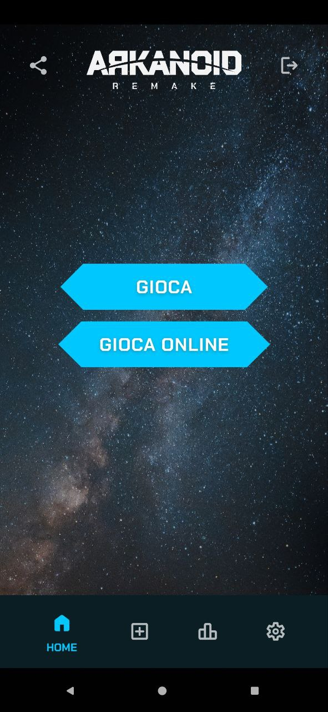
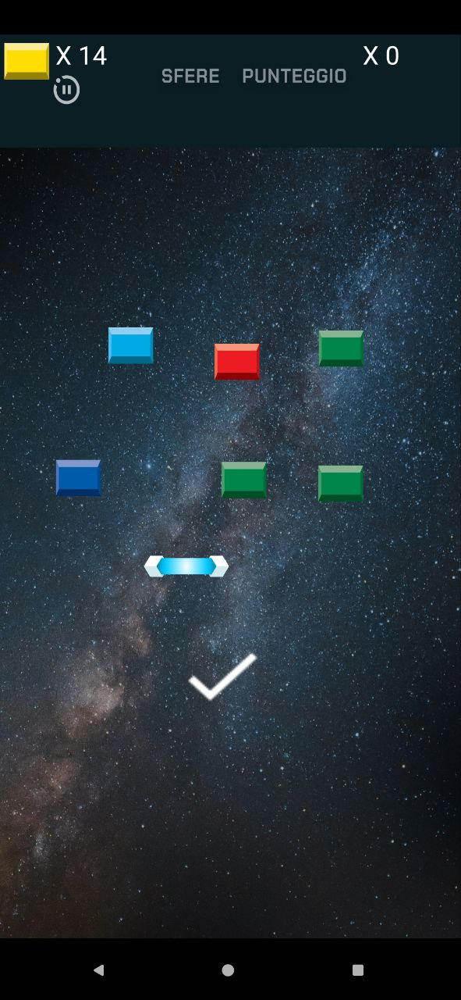
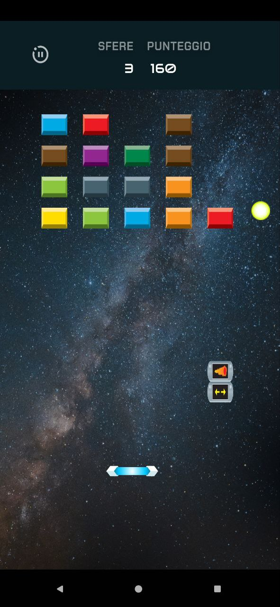
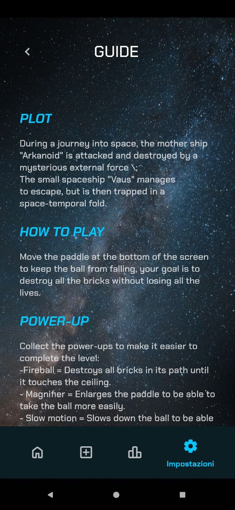

# Arkanoid Remake

Durante un viaggio nello spazio, l'astronave madre "Arkanoid" viene attaccata e distrutta da una misteriosa forza esterna;
La piccola astronave "Vaus" riesce a scappare,
ma rimane poi intrappolata in una piega spazio\temporale.

## Download APK

- [Scarica l'APK](https://github.com/Lorisforse/Arkanoid_remake/releases/download/V1.0.0/Arkanoid.remake.apk)

## Screenshot

## Documentazioni

- [Presentazione](Screen/presentazione.pdf)

## Funzionalità

- Livello di difficoltà incrementale (Facile Medio Difficile);

- Creazione di un livello personalizzato;

- Personalizzazione dell’esperienza di gioco(Lingua -Tipo Input)

- Possibilità di gioco competitivo tramite la modalità Multiplayer;

- Interfacce di navigazione dei menu intuitive e dinamiche
