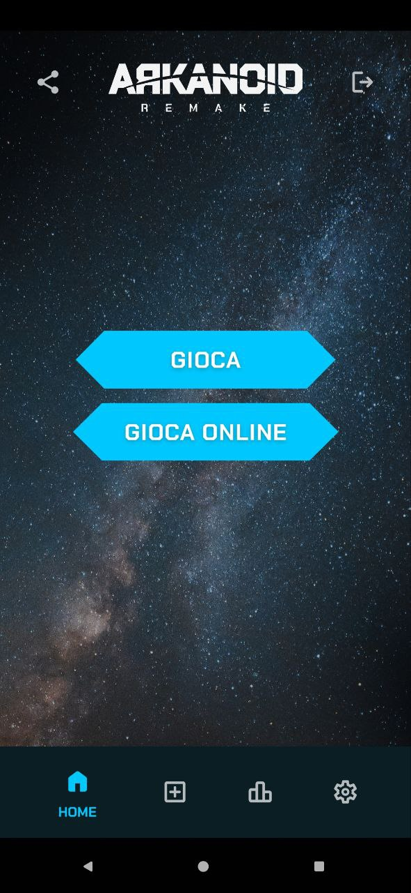
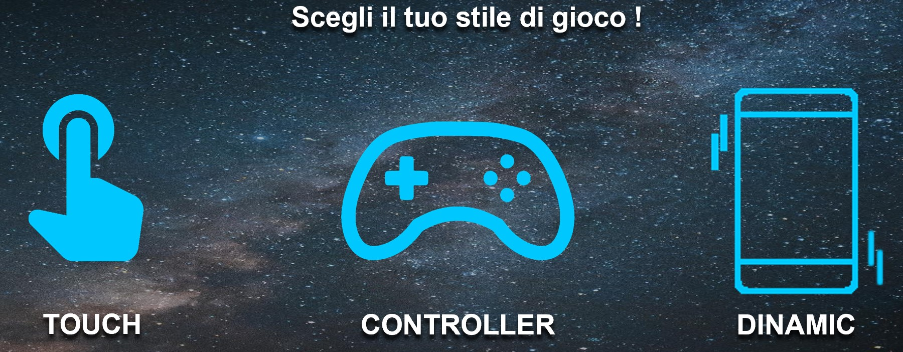
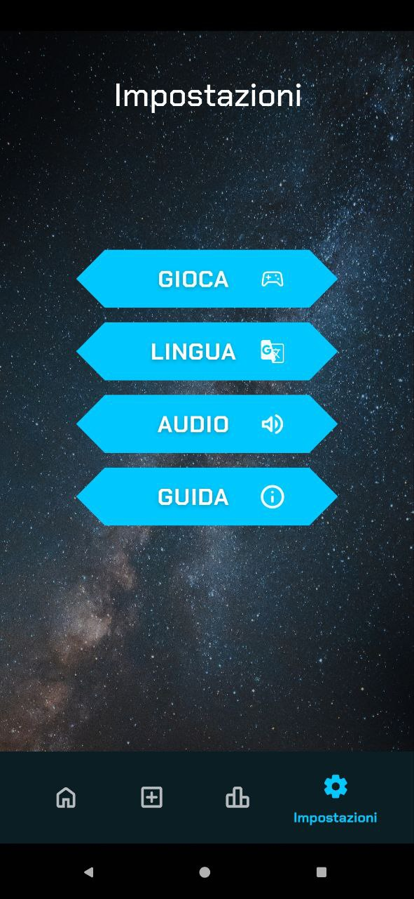
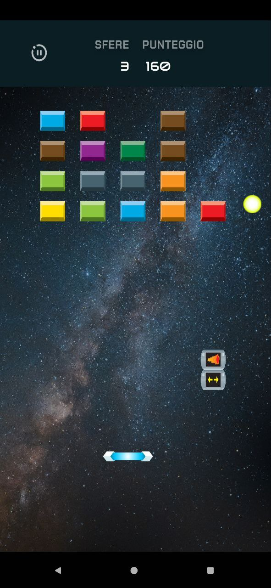
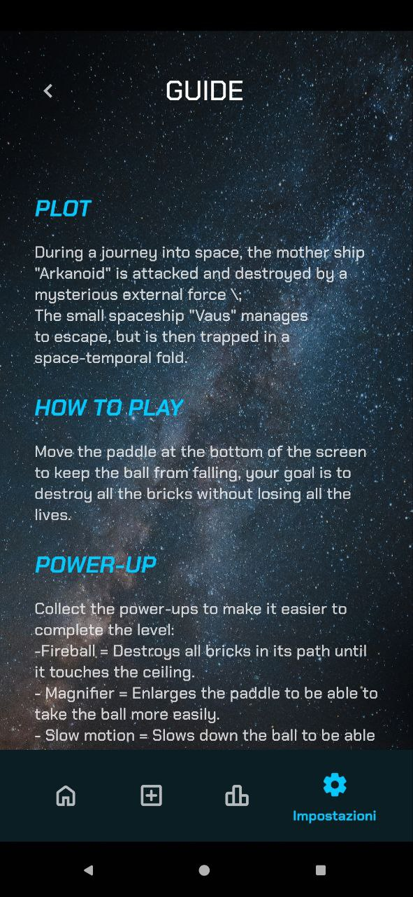
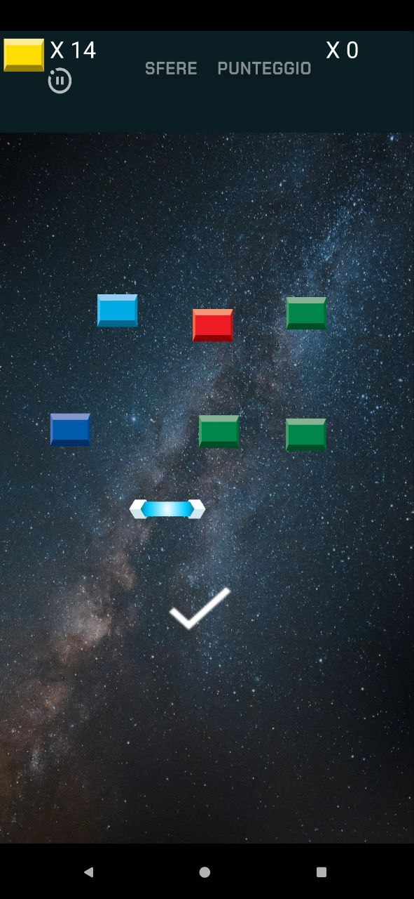

# Arkanoid Remake


> *Durante un viaggio nello spazio, l'astronave madre "Arkanoid" viene attaccata e distrutta da una misteriosa forza esterna. La piccola astronave "Vaus" riesce a scappare, ma rimane poi intrappolata in una piega spazio-temporale.*

Un remake mobile del classico arcade **Arkanoid** per Android, con modalità multiplayer online, livelli personalizzabili e diversi tipi di controllo.

---

## Screenshot

| Menu Principale | Modalità di gioco | Opzioni |
|:-:|:-:|:-:|
|  |  |  |

| Partita in corso | Guida | Livello Custom |
|:-:|:-:|:-:|
|  |  |  |

---

## Download

[](https://github.com/Lorisforse/Arkanoid_remake/releases/download/V1.0.0/Arkanoid.remake.apk)

---

## Funzionalità

- **3 difficoltà** — Facile, Medio, Difficile, con numero di vite e velocità della pallina progressivi
- **Livello personalizzato** — Crea e salva la tua griglia di mattoni con il builder integrato
- **Power-Up** — Palla di fuoco, palette allargata, palla di ghiaccio e vite extra
- **Multiplayer online** — Sfida un amico in tempo reale tramite Firebase Realtime Database
- **3 tipi di controllo** — Touchscreen, joystick virtuale e accelerometro
- **4 lingue** — Italiano, Inglese, Spagnolo, Francese
- **Classifica locale** — Record dei punteggi salvati sul dispositivo
- **Effetti sonori e musica** — Colonna sonora con SoundPool e MediaPlayer

---

## Tech Stack

| Layer | Tecnologia |
|-------|-----------|
| Linguaggio | Java 8 |
| UI | Android Views custom (`SurfaceView`-style) |
| Multiplayer | Firebase Realtime Database |
| Controllo sensori | `SensorManager` (Accelerometro) |
| Audio | `MediaPlayer` + `SoundPool` |
| Navigazione | `FragmentManager` + back stack |
| Persistenza | `SharedPreferences` + File I/O |

---

## Architettura

```
javaClass_activity/
├── SplashScreen.java   — Schermata di avvio
├── MainMenu.java       — Activity principale con Fragment navigation
├── MainActivity.java   — Game loop + UpdateThread
├── Game.java           — Logica di gioco, collision detection, rendering
├── Ball.java           — Fisica della pallina
├── Paddle.java         — Movimento della palette
├── Brick.java          — Mattoni (breakable/unbreakable)
├── PowerUp.java        — Power-up con effetti
├── Joystick.java       — Joystick virtuale custom
├── UpdateThread.java   — Thread di aggiornamento a ~30 FPS
├── SoundPlayer.java    — Gestione audio
└── CustomLevel.java    — Editor livello personalizzato

fragment/
├── HomeFragment        — Home con accesso al gioco offline/online
├── DifficultyFragment  — Selezione difficoltà
├── GameModeFragment    — Selezione tipo di controllo
├── RoomsFragment       — Lobby multiplayer Firebase
├── RecordFragment      — Classifica punteggi
├── LanguageFragment    — Cambio lingua
├── CustomLevelFragment — Accesso al builder di livelli
├── GuideFragment       — Guida al gioco
├── SettingsFragment    — Impostazioni audio
└── ExitFragment        — Conferma uscita
```

---

## Modalità di gioco

| Modalità | Descrizione |
|----------|-------------|
| **Facile** | Griglia 5×6, pallina lenta, mattoni con 1-2 vite |
| **Medio** | Griglia 6×7, mattoni indistruttibili casuali |
| **Difficile** | Griglia 7×8, pallina veloce, più mattoni resistenti |
| **Custom** | Gioca il livello che hai disegnato tu |
| **Multiplayer** | Crea o entra in una stanza e sfida un avversario online |

---

## Controlli

| Tipo | Descrizione |
|------|-------------|
| **Touchscreen** | Trascina il dito per muovere la palette |
| **Joystick** | Joystick virtuale in basso a sinistra |
| **Accelerometro** | Inclina il telefono per controllare la palette |

---

## Build & Run

### Requisiti
- Android Studio Hedgehog o superiore
- JDK 8+
- Android SDK 21+
- File `google-services.json` nella cartella `app/` (richiesto da Firebase)

### Passi
```bash
# Clona il repository
git clone https://github.com/Lorisforse/Arkanoid_remake.git
cd Arkanoid_remake

# Apri con Android Studio e sincronizza Gradle
# Oppure da terminale:
./gradlew assembleDebug

# Installa su dispositivo connesso
./gradlew installDebug
```

---

## Documentazione

- [Presentazione del progetto (PDF)](Screen/presentazione.pdf)

---

## Licenza

Distribuito sotto licenza **MIT**. Vedi [LICENSE](LICENSE) per i dettagli.
